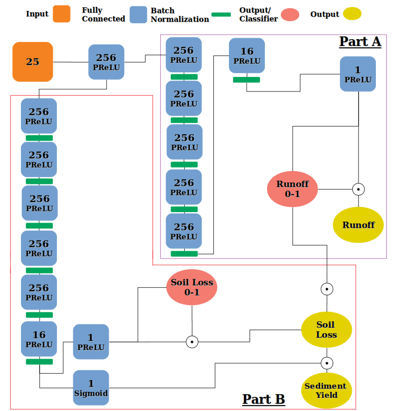

# An Artificial Neural Network-Based Emulator of the RHEM

This repository contains the source code of an artificial neural network (ANN) that emulates the Rangeland Hydrology and Erosion Model [**(RHEM)**](https://dss.tucson.ars.ag.gov/rhem/). 
The tutorial notebooks are the step-by-step guide to use the trained Emulator and to create one from scratch, train and evaluate it.

### Description

**RHEM** is a newly conceptualized, process-based erosion prediction tool specific for rangeland application, based on fundamentals of infiltration, hydrology, plant science,
hydraulics and erosion mechanics. 
For the applications such as hydraulic soil erosion estimation over a large area and at a finer spatial scale, RHEM requires too much computation time and resources. 
We designed an ANN that is able to recreate the RHEM outputs 
(runoff, soil loss, and sediment yield) with high accuracy and 13 billion times faster computation time. Figure below shows the architecture of the ANN.

### Required Python Packages

The following Python packages are required to run the the tutorial notebooks:

- [Tensorflow](https://www.tensorflow.org/) (Tensorflow-GPU is recommended)
- [Numpy](https://numpy.org/)
- [SciPy](https://scipy.org/)
- [Pandas](https://pandas.pydata.org/)
- [Matplotlib](https://matplotlib.org/)
- [scikit-learn](https://scikit-learn.org/stable/)
- [ipyleaflet](https://ipyleaflet.readthedocs.io/en/latest/)
- [ipywidgets](https://ipywidgets.readthedocs.io/en/latest/)
- [GeoPandas](https://geopandas.org/en/stable/)
- [SALib](https://salib.readthedocs.io/en/latest/)

### Tutorial Notebooks

- **Use_Emulator.ipynb** is a step-by-step guide to:
  - Create a RHEM scenario or a batch of scenarios 
  - Run the Emulator in the single mode and batch mode

- **Train_Emulator.ipynb** is a step-by-step guide to:
  - Create the Emulator from scratch and train it
  - Evaluate the trained Emulator with different approaches to see if it resembles the RHEM.

### Files

- **Data**

  1- dataset.csv: The synthetic RHEM scenarios and their corresponding RHEM runs 

  2- NRI_dataset.csv: The real world RHEM scenarios and their corresponding RHEM runs
  
  3- batch_items.csv: A batch of RHEM scenarios template

  4- diffNRI.npz: The numpy array that contains the temporal variations of the RHEM outputs at specific surveyed locations

- **Trained_Emulator**

  1- emulator.h5: A ready to use RHEM Emulator trained with synthetic scenarios
  
  2- emulator_fineTuned.h5: A fine-tuned version of the emulator.h5 file based on the real-world scenarios

- **Parameter_Files**

  1- CLIGEN_points.shp (.shx, .dbf, .prj): The shapefile of the CLIGEN station points
  
  2- Soil_Hydraulic_Properties.csv: The table of the hydraulic properties of each soil texture

  3- cligen.csv: The table of the average climatic properties (Precipitation amount and duration as well as its time to peak) of each CLIGEN station

- **Training_loss** 
  
  The .csv files of the Emulator training loss values after each epoch

- **Normalizers** 

  The .pkl files required to normalize the training data of the Emulator into [0,1] range.

- **Cross-Validation_Results**
  
  The .pkl files that contain the results of the out-of-sample testing of the cross-validation loop of the Emulator using the synthetic RHEM scenarios.

- **Change_Pattern_Evaluation**
  
  The .csv files required to test the Emulator to see if it resembles the change patterns of the RHEM outputs when all but one input variables are modified.

### Reference
- 

